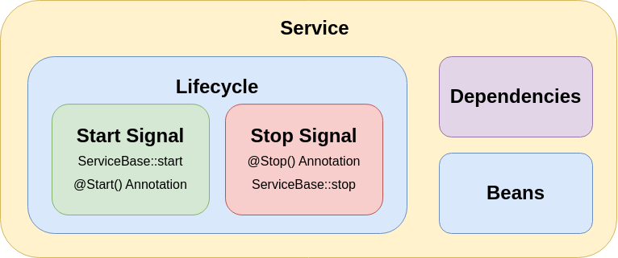

# Services

Services are defined by annotating a class with the service annotation. The class must have exactly one constructor which will be automatically invoked by the activator later. All constructor parameters have to also be fields of the class and are interpreted as dependencies which can be supplied by the [di-container.md](../../docs/core/di-container.md "mention").

Services are a abstract and high-level implementation of a dependency provider which have their own system linked lifecycle. The definition of a service is represented as a ServiceDescriptor at runtime and contains information on how to construct a service instance, what dependencies the service and which it publishes and how to start and stop an existing service instance.

<figure><figcaption></figcaption></figure>

## Code Examples


```dart
import 'package:darwin_sdk/darwin.dart';

@Service()
class ServiceExample {}
```


Services can hook into their lifecycle signals by using the Start and Stop annotations on any method which has no parameters and returns either void or a Future.


```dart
import 'package:darwin_sdk/darwin.dart';

@Service()
class ServiceExample {
  
  @Start()
  void init() {}
  
  @Stop()
  void destruct() {}
}
```


Dependencies can be declared using a constructor-initialised field as previously mentioned.


```dart
import 'package:darwin_injector/darwin_injector.dart';
import 'package:darwin_sdk/darwin.dart';
import 'package:example/services/service_a.dart';

// In this example we expect, that both the String 'firstname', the int 'age' and
// a ServiceA exist in the system. 
@Service()
class ServiceExample {

  ServiceA serviceA;
  String name;
  int age;

  ServiceExample(
      this.serviceA, 
      @Named("firstname") this.name,
      @Named("age") this.age
  );
}
```

