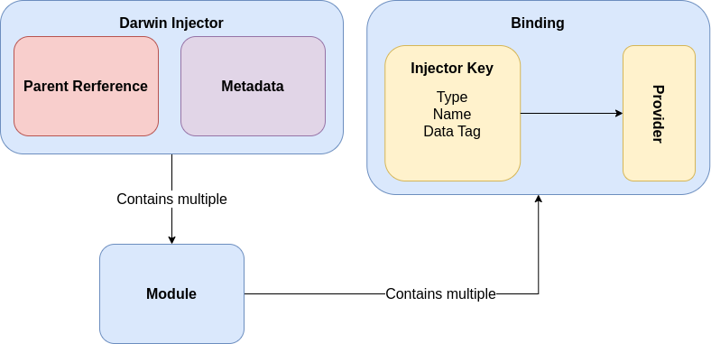

# Dependency Injection

The providers are bound to injector keys, a simple and comparable form of type identification. Each key must have a single type to which it is bound and can additionally define a name and custom data. Names are useful if multiple bindings with the same type (for example String) are meant to coexist in the same system or if the dependency is meant to be explicitly scoped. The data field is reserved for edge-cases, where additional specification is required. Providers are executed asynchronously, allowing for async factories and data-sources to be bound to the injection system.

<figure><figcaption></figcaption></figure>
